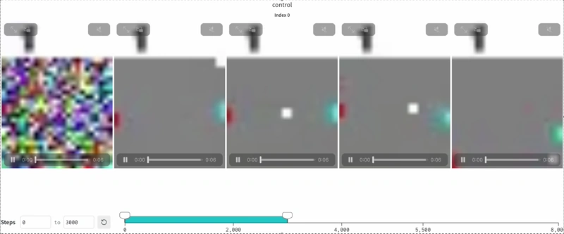

# TLDR

A toy implementation of a diffusion transformer based "world model" trained on 9 hours of pong. Shoutout [@pufferlib](https://github.com/PufferAI/PufferLib/blob/3.0/pufferlib/ocean/pong/pong.h) for their great pong environment that was used for dataset creation.

**Training dashboard.**
0: unconditional, 1:don't move, 2:up, 3:down (for cyan)

The only optimization this codebase really uses so far is `flexattention` but even without it you can train a pong simulator within a reasonable budget.

The folder structure and repo are hopefully self explanatory. If you have any questions or find bugs or problems with the environment setup please don't hesitate to create an issue.

# Setup

- install dependencies using `uv sync`

# Inference / running the demo

- download model `uv run scripts/download_model.py`
- start pong server `uv run play_pong.py`

# Training

- download pong dataset `uv run scripts/download_dataset.py`
- you can train your own pong simulator using (should take <= 30 minutes on a A6000): `uv run python -m src.main`
- to use it update `configs/inference.yaml`. By default, the checkpoints will be in `./experiments/wandb-run-name`. If you want to play with your model while it is training you can put the run folder into the checkpoint field. Then run `uv run python play_pong.py`. This should start a server running pong that you can connect to and play interactively. There is also `generate_with_cache.ipynb` to play around with inference.

# Technical details

- the model architecture is mostly a vanilla mmDiT applied over a sequence of frame patches and conditioned on actions from the previous frame using AdaLN. See: https://arxiv.org/abs/2212.09748
- the trainer is based on rectified flow matching with logit-normal–sampled noise levels, as in the SD3 paper: https://arxiv.org/abs/2403.03206
- the sampling procedure uses the simple discrete Euler rule with SD3’s scheduler and default settings: https://github.com/huggingface/diffusers/blob/v0.35.1/src/diffusers/schedulers/scheduling_flow_match_euler_discrete.py#L47
- to train a frame-autoregressive model, diffusion forcing is used: https://arxiv.org/abs/2407.01392
- frame-autoregressive diffusion transformers allow for efficient inference by leveraging KV caching
- default settings use simple RoPE (https://arxiv.org/abs/2104.09864) over the entire sequence without special treatment of spatial or temporal dimensions

# Resources

Other repositories that I found useful along the way:

- [minRF](https://github.com/cloneofsimo/minRF)
- [owl-wms](https://github.com/Wayfarer-Labs/owl-wms)

