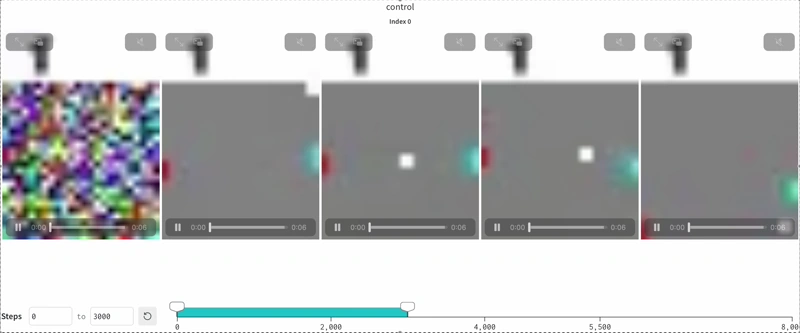

# TLDR

A toy implementation of a diffusion transformer based "world model". Supports both **Pong** (pixel space, 9 hours of gameplay) and **Doom** (latent space via DC-AE, PvP deathmatch). Shoutout [@pufferlib](https://github.com/PufferAI/PufferLib/blob/3.0/pufferlib/ocean/pong/pong.h) for their great pong environment that was used for dataset creation.

**Training dashboard.**
0: unconditional, 1:don't move, 2:up, 3:down (for cyan)


The only optimization this codebase really uses so far is `flexattention` but even without it you can train a pong simulator within a reasonable budget.

The folder structure and repo are hopefully self explanatory. If you have any questions or find bugs or problems with the environment setup please don't hesitate to create an issue.

# Setup

- install dependencies using `uv sync`

# Inference / running the demo

## Pong

- download model `uv run scripts/download_model.py`
- start pong server: `uv run python play_pong.py`
- server runs at http://localhost:5000

## Doom

- train a model first (see Training below), or use a checkpoint
- start doom server: `uv run python play_doom.py --checkpoint experiments/<run-name>/model.pt`
- server runs at http://localhost:4444
- controls: WASD + mouse look + click to shoot (click frame to capture mouse, Esc to release)

# Training

## Pong

- download pong dataset `uv run scripts/download_dataset.py`
- train a pong simulator (should take <= 30 minutes on a A6000): `uv run python -m src.main --config configs/pong.yaml`. The first few training steps are slow due to `torch.compile` graph capture.
- to use it update `configs/inference.yaml`. By default, the checkpoints will be in `./experiments/wandb-run-name`. If you want to play with your model while it is training you can put the run folder into the checkpoint field. Then run `uv run python play_pong.py`. This should start a server running pong that you can connect to and play interactively. There is also `generate_with_cache.ipynb` to play around with inference.

## Doom (latent diffusion)

The Doom world model operates in latent space using [DC-AE](https://huggingface.co/mit-han-lab/dc-ae-lite-f32c32-sana-1.1-diffusers) (32x spatial compression, 32 channels). The dataset contains pre-encoded latent frames from Doom PvP deathmatch gameplay.

### 1. Download dataset

```bash
# 5 shards / ~20 GB (default, enough for training):
uv run scripts/download_doom_dataset.py
# or to a custom location:
uv run scripts/download_doom_dataset.py --output /tmp/doom_latents
# minimal test (1 shard / ~4 GB):
uv run scripts/download_doom_dataset.py --n-shards 1
# everything (~770 GB):
uv run scripts/download_doom_dataset.py --all
```

If you download to a custom location, pass `--shard-dir` to the training and play scripts.

### 2. Train

```bash
uv run python -m src.main --config configs/doom.yaml
# or with a custom shard location:
uv run python -m src.main --config configs/doom.yaml --shard-dir /tmp/doom_latents
```

The default config trains for 5000 steps with batch_size=64 in bf16. On an A6000 (48 GB), this takes ~2.5 hours at ~1.65s/step. Loss goes from ~5.4 to ~1.3. The first step is slow (~4 min) due to `torch.compile` graph capture.

Checkpoints are saved every 500 steps to `experiments/<wandb-run-name>/`. The final model is saved as `model.pt` in the same directory.

### 3. Play

```bash
uv run python play_doom.py --checkpoint experiments/<run-name>/model.pt
# or with a custom shard location (used for start frame loading):
uv run python play_doom.py --checkpoint experiments/<run-name>/model.pt --shard-dir /tmp/doom_latents
```

The server starts at http://localhost:4444. Startup takes several minutes (model + VAE compilation, warmup, start frame loading). Controls: WASD to move, mouse to look, click to shoot (click the frame to capture the mouse, Esc to release). The DC-AE VAE decoder (~1 GB) is downloaded automatically on first use.

If running on a remote server, use SSH port forwarding: `ssh -L 4444:localhost:4444 <host>`

# Technical details

- the model architecture is mostly a vanilla mmDiT applied over a sequence of frame patches and conditioned on actions from the previous frame using AdaLN. See: https://arxiv.org/abs/2212.09748
- the trainer is based on rectified flow matching with logit-normal–sampled noise levels, as in the SD3 paper: https://arxiv.org/abs/2403.03206
- the sampling procedure uses the simple discrete Euler rule with SD3’s scheduler and default settings: https://github.com/huggingface/diffusers/blob/v0.35.1/src/diffusers/schedulers/scheduling_flow_match_euler_discrete.py#L47
- to train a frame-autoregressive model, diffusion forcing is used: https://arxiv.org/abs/2407.01392
- frame-autoregressive diffusion transformers allow for efficient inference by leveraging KV caching
- default settings use simple RoPE (https://arxiv.org/abs/2104.09864) over the entire sequence without special treatment of spatial or temporal dimensions

# Resources

Other repositories that I found useful along the way:

- [minRF](https://github.com/cloneofsimo/minRF)
- [owl-wms](https://github.com/Wayfarer-Labs/owl-wms)

